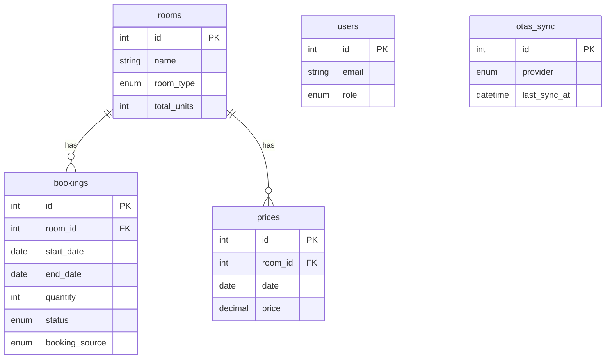

# 📋 Homestay Accommodation - Project Review & Roadmap

> Ngày cập nhật: **2026-02-28**

---

## 1. Tổng quan dự án

**Mục tiêu:** Xây dựng hệ thống quản lý phòng trọ/homestay — bao gồm quản lý phòng trống, booking trực tuyến, thanh toán & đồng bộ OTA (Booking.com, Airbnb, Agoda).

**Tech Stack:**
| Layer | Technology |
|-------|-----------|
| Backend | FastAPI + SQLAlchemy 2.0 + PostgreSQL + psycopg3 |
| Caching | Redis |
| Migration | Alembic |
| Validation | Pydantic V2 + pydantic-settings |
| Testing | pytest + SQLite in-memory + Starlette TestClient |
| Frontend (planned) | React + Tailwind CSS |

---

## 2. Cấu trúc dự án

```
homestay_accomodation_ver1/
├── backend/
│   ├── __init__.py
│   ├── main.py              # FastAPI app, include routers
│   ├── config.py             # Settings (pydantic-settings, env file)
│   ├── db.py                 # SQLAlchemy engine, SessionLocal, Base, get_db()
│   ├── api/
│   │   ├── availability.py   # GET /availability/ — check phòng trống
│   │   └── bookings.py       # POST /bookings/ — tạo booking mới
│   ├── models/
│   │   ├── room.py           # Room model (private/dorm)
│   │   ├── booking.py        # Booking model (status, source, dates)
│   │   ├── user.py           # User model (roles: admin/receptionist/user)
│   │   ├── price.py          # Price model (giá theo ngày)
│   │   └── ota_sync.py       # OTASync model (log đồng bộ OTA)
│   ├── schemas/
│   │   ├── availability.py   # AvailabilityRequest/Response, RoomAvailability
│   │   └── booking.py        # BookingCreate, BookingResponse
│   ├── tests/
│   │   ├── conftest.py       # Test setup (SQLite in-memory, clean_db fixture)
│   │   ├── test_availability.py  # 3 tests cho availability
│   │   └── test_bookings.py      # 2 tests cho booking
│   └── migrations/
│       ├── env.py
│       └── versions/
│           └── 0001_initial_schema.py
├── backlog/
│   └── TASKS.md              # Sprint backlog
├── features/
│   └── availability.md       # Feature spec: availability module
├── scripts/
│   └── seed.py               # Seed data (12 private rooms + 2 dorms)
├── AGENTS.md                 # Agent instructions
├── DESIGN_DECISIONS.md       # Quyết định kiến trúc
├── PROJECT_STATE.md          # Trạng thái dự án (cũ)
├── alembic.ini               # Alembic config
└── requirements.txt          # Dependencies
```

---

## 3. Cấu trúc Database (Schema)

### 3.1. Bảng `rooms`
| Column | Type | Mô tả |
|--------|------|-------|
| id | Integer PK | |
| name | String(100) UNIQUE | Tên phòng |
| room_type | Enum(private, dorm) | Loại phòng |
| total_units | Integer | Số đơn vị (1 cho private, N cho dorm) |
| description | Text, nullable | Mô tả |
| max_occupancy | Integer, nullable | Sức chứa tối đa |
| base_price | Numeric(10,2), nullable | Giá gốc |
| ota_room_id | String(100), nullable | ID phòng trên OTA |
| created_at / updated_at | DateTime(tz) | Timestamps |

### 3.2. Bảng `bookings`
| Column | Type | Mô tả |
|--------|------|-------|
| id | Integer PK | |
| room_id | FK → rooms.id | Phòng được đặt |
| guest_name | String(255) | Tên khách |
| guest_email | String(255), nullable | Email khách |
| start_date | Date | Ngày check-in |
| end_date | Date | Ngày check-out |
| quantity | Integer, default=1 | Số giường/phòng đặt |
| status | Enum(pending, confirmed, cancelled) | Trạng thái |
| booking_source | Enum(direct, booking_com, airbnb, agoda, other) | Nguồn booking |
| external_booking_id | String(255), nullable | ID booking từ OTA |
| created_at / updated_at | DateTime(tz) | Timestamps |

### 3.3. Bảng `users`
| Column | Type | Mô tả |
|--------|------|-------|
| id | Integer PK | |
| email | String(255) UNIQUE | |
| hashed_password | String(255) | |
| full_name | String(255), nullable | |
| role | Enum(admin, receptionist, user) | |
| is_active | Boolean, default=True | |
| created_at / updated_at | DateTime(tz) | |

### 3.4. Bảng `prices`
| Column | Type | Mô tả |
|--------|------|-------|
| id | Integer PK | |
| room_id | FK → rooms.id (CASCADE) | |
| date | Date | Ngày áp dụng giá |
| price | Numeric(10,2) | Giá |
| currency | String(3), default="VND" | |
| created_at / updated_at | DateTime(tz) | |

### 3.5. Bảng `otas_sync`
| Column | Type | Mô tả |
|--------|------|-------|
| id | Integer PK | |
| provider | Enum(booking_com, airbnb, agoda) | Nhà cung cấp OTA |
| last_sync_at | DateTime, nullable | Thời gian sync cuối |
| last_sync_status | Enum(success, error), nullable | |
| last_sync_message | Text, nullable | Thông báo lỗi |
| created_at / updated_at | DateTime(tz) | |

### Quan hệ giữa các bảng



---

## 4. Logic xử lý chính

### 4.1. Availability Logic (`GET /availability/`)

**Mục đích:** Trả về danh sách phòng còn trống trong khoảng ngày check_in → check_out.

**Quy trình:**
1. Validate `check_in < check_out`, trả 400 nếu sai
2. Tạo subquery tính tổng `quantity` đã đặt cho mỗi phòng (chỉ tính booking PENDING/CONFIRMED có overlap)
3. Overlap logic: `booking.start_date < check_out AND booking.end_date > check_in`
4. LEFT JOIN rooms với subquery → `available_units = total_units - booked_quantity`
5. Chỉ trả phòng có `available_units > 0`

**Điểm quan trọng:**
- Booking CANCELLED **không được tính** vào occupied quantity
- Ngày checkout = ngày checkin tiếp theo → **không overlap** (half-day logic)

### 4.2. Booking Logic (`POST /bookings/`)

**Mục đích:** Tạo booking mới, kiểm tra availability trước khi tạo.

**Quy trình:**
1. Validate `start_date < end_date` (Pydantic `@field_validator` + API level)
2. Kiểm tra room tồn tại
3. Tính tổng quantity đã book (PENDING/CONFIRMED, overlap dates)
4. `available_units = total_units - booked_quantity`
5. Nếu `available_units < requested_quantity` → trả 400
6. Tạo booking với `status=PENDING`, `source=DIRECT`
7. Commit và trả BookingResponse

### 4.3. Test Infrastructure

- **SQLite in-memory** cho tests (không cần PostgreSQL)
- **`clean_db` fixture** (autouse): drop + recreate tất cả bảng giữa các test → đảm bảo test isolation
- **`TestClient`** wrap FastAPI app, override `get_db` dependency

---

## 5. Nhiệm vụ đã hoàn thành ✅

### Sprint 1 — Foundation
- [x] Setup project structure (backend/, models/, schemas/, api/, tests/)
- [x] Tạo Database schema đầy đủ: rooms, bookings, users, prices, otas_sync
- [x] Alembic migration initial (`0001_initial_schema.py`)
- [x] Config với pydantic-settings (PostgreSQL, Redis, .env)
- [x] Seed data script (12 private rooms + 2 dorms)

### Sprint 2 — Availability
- [x] API `GET /availability/` — check phòng trống theo ngày
- [x] Overlap logic chính xác (half-day checkout/checkin)
- [x] Chỉ tính booking PENDING/CONFIRMED
- [x] 3 unit tests cho availability:
  - ✅ Checkout/checkin cùng ngày không trùng
  - ✅ Dorm quantity calculation chính xác
  - ✅ Booking CANCELLED bị bỏ qua

### Sprint 3 — Booking
- [x] API `POST /bookings/` — tạo booking với anti-overbooking check
- [x] Pydantic V2 validation (field_validator, ValidationInfo)
- [x] 2 unit tests cho booking:
  - ✅ Tạo booking thành công khi còn phòng
  - ✅ Từ chối khi hết phòng

### Bugfixes (2026-02-28)
- [x] Fix Pydantic V2 `@field_validator` dùng `ValidationInfo` thay cho `dict`
- [x] Fix `ConfigDict` thay cho deprecated `class Config` (booking schema + settings)
- [x] Fix SQLAlchemy nested transaction (`db.begin()` khi session đã autobegin)
- [x] Fix date format trong test (`2026-04-1` → `2026-04-01`)
- [x] Fix flaky test assertion (tìm room cụ thể thay vì giả sử chỉ có 1 room)

**Kết quả test hiện tại: ✅ 5/5 PASSED**

---

## 6. Nhiệm vụ cần làm tiếp theo 🔧

### ⚡ Ưu tiên cao (Ngay)

- [ ] **Authentication & Authorization**
  - [ ] JWT login/register endpoint (`POST /auth/login`, `POST /auth/register`)
  - [ ] Middleware xác thực token
  - [ ] Role-based access: admin, receptionist, user
  - [ ] Bảo vệ endpoints: booking chỉ user đã login, manage rooms chỉ admin

- [ ] **CRUD Rooms API**
  - [ ] `GET /rooms/` — danh sách phòng
  - [ ] `GET /rooms/{id}` — chi tiết phòng
  - [ ] `POST /rooms/` — tạo phòng (admin only)
  - [ ] `PUT /rooms/{id}` — sửa phòng (admin only)
  - [ ] `DELETE /rooms/{id}` — xóa phòng (admin only)

- [ ] **CRUD Bookings mở rộng**
  - [ ] `GET /bookings/` — danh sách booking (admin/receptionist)
  - [ ] `GET /bookings/{id}` — chi tiết booking
  - [ ] `PUT /bookings/{id}/cancel` — huỷ đặt phòng
  - [ ] `PUT /bookings/{id}/confirm` — xác nhận booking

### 🔶 Ưu tiên trung bình

- [ ] **Price Management**
  - [ ] `POST /prices/` — set giá theo ngày cho phòng
  - [ ] `GET /prices/` — xem bảng giá
  - [ ] Tích hợp giá vào availability response

- [ ] **Redis Cache**
  - [ ] Cache availability query
  - [ ] Invalidate cache khi booking mới tạo/huỷ
  - [ ] Thiết lập Redis connection pool

- [ ] **Users Management**
  - [ ] `GET /users/me` — thông tin user hiện tại
  - [ ] `PUT /users/me` — cập nhật profile

### 🔷 Ưu tiên thấp (Phase 2)

- [ ] **OTA Sync**
  - [ ] Cron job fetch booking từ Booking.com, Airbnb, Agoda (1AM hàng ngày)
  - [ ] API `GET /ota-sync/status` — trạng thái đồng bộ
  - [ ] Webhook receiver cho OTA notifications

- [ ] **Payment Integration (Stripe)**
  - [ ] Tạo payment intent khi booking
  - [ ] Webhook xác nhận thanh toán
  - [ ] Cập nhật booking status sau khi thanh toán

- [ ] **Frontend (React + Tailwind CSS)**
  - [ ] Home page — search phòng trống
  - [ ] Room detail page
  - [ ] Booking form
  - [ ] Admin dashboard (quản lý phòng, booking)

---

## 7. Ghi chú kỹ thuật quan trọng ⚠️

1. **Pydantic V2 đã được migrate:** Dùng `ValidationInfo`, `ConfigDict`, `SettingsConfigDict` (không dùng `class Config` deprecated)
2. **SQLAlchemy autobegin:** Không gọi `db.begin()` khi session đã autobegin — dùng `db.commit()` trực tiếp
3. **Overlap logic:** `start_date < end_date_query AND end_date > start_date_query` — đây là interval overlap chuẩn, checkout cùng ngày checkin **KHÔNG** overlap
4. **Test isolation:** Fixture `clean_db` drop + recreate toàn bộ tables giữa mỗi test
5. **`datetime.utcnow()` deprecated:** Cần chuyển sang `datetime.now(datetime.UTC)` trong models (Room, Booking, User, Price, OTASync) — chưa fix
6. **Seed data:** 12 private rooms (1 unit each) + 2 dorms (8 beds each) — chạy bằng `python scripts/seed.py`
